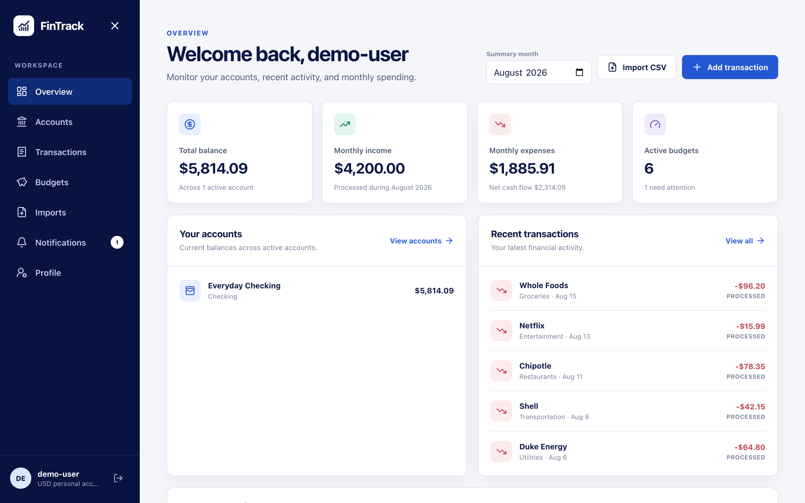
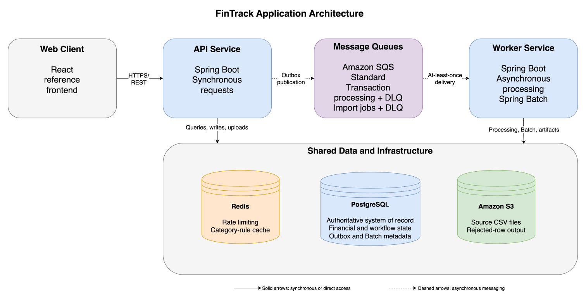

# FinTrack

An open-source, event-driven personal finance platform built with Java 21, Spring Boot, Spring Security, Spring Batch, PostgreSQL, Redis, Amazon SQS, and AWS.

[](https://github.com/icastanon/fintrack-platform/actions/workflows/deploy-backend.yml)
[](https://github.com/icastanon/fintrack-platform/actions/workflows/deploy-frontend.yml)

FinTrack lets users manage financial accounts, record transactions, import CSV files, track monthly budgets, review spending summaries, and receive budget notifications.

Under the hood, FinTrack brings together REST API design, Spring Security and token lifecycle management, PostgreSQL data modeling and transactional consistency, Redis-backed rate limiting, asynchronous SQS workflows, restartable Spring Batch processing, concurrency and failure recovery, automated testing, and observability. Docker, Terraform, GitHub Actions, and AWS provide the project’s local development, infrastructure, deployment, and operational layers.

A lightweight React client is included to demonstrate and manually exercise the backend.

## Live project

- [Open FinTrack](https://d239jpeymow4m4.cloudfront.net)
- [Explore the API with Swagger UI](https://d239jpeymow4m4.cloudfront.net/swagger-ui/index.html)
- [Read the documentation](docs/README.md)



The hosted environment is a cost-conscious development deployment and may occasionally be unavailable while infrastructure is being changed or suspended.

## What FinTrack does

### Security and identity

- Authenticate users through Spring Security.
- Issue JWT access tokens for stateless request authentication.
- Rotate, hash, expire, revoke, and persist refresh tokens.
- Use database locking to protect concurrent refresh-token rotation.
- Hash user passwords with BCrypt.
- Enforce user and administrator authorization rules.
- Apply Redis-backed rate limits to authentication, authenticated API requests, and import submissions.
- Restrict browser access through configurable CORS rules.
- Store deployment secrets in AWS Secrets Manager and provide AWS access through IAM roles.

### Financial accounts

- Create and update financial accounts.
- Track opening and current balances.
- Close accounts without losing their transaction history.
- Keep all monetary data in the user’s selected base currency.

### Transactions

- Create income and expense transactions.
- Process transaction enrichment asynchronously.
- Categorize transactions automatically using configurable matching rules.
- Allow users to override automatic categorization.
- Filter and paginate transaction history.

### CSV imports

- Upload transaction CSV files through the API.
- Store source files privately in Amazon S3.
- Process large files in restartable Spring Batch chunks.
- Track import status and row counts.
- Skip supported row-level validation failures.
- Build downloadable rejected-row CSV files.
- Recover interrupted imports without restarting the entire file.

### Budgets and notifications

- Create monthly category budgets.
- Calculate current spending directly from processed transactions.
- Identify on-track, warning, and over-budget states.
- Create persistent budget notifications.
- Track unread notifications.

### Financial summaries

- Compare monthly income and expenses.
- Review spending by category.
- Review spending by account.
- Inspect current budget usage.

## Architecture at a glance

FinTrack contains two independently deployable Spring Boot applications within one financial-management bounded context:

- **API service:** owns HTTP endpoints, Spring Security, authentication, authorization, account and transaction commands, queries, file uploads, Flyway migrations, and the transactional outbox relay.
- **Worker service:** consumes Amazon SQS messages, categorizes transactions, evaluates budgets, creates notifications, and runs restartable CSV imports with Spring Batch.
- **Event contracts:** provides immutable event payloads shared by the API and worker without introducing a direct service dependency.
- **Reference frontend:** provides a responsive React interface for exercising the backend.

The services intentionally share one PostgreSQL database. This keeps transactional business rules practical for the current system while leaving explicit boundaries for future extraction if independent service ownership becomes justified.



Read the [Architecture overview](docs/architecture/overview.md) for component responsibilities, runtime dependencies, and primary data flows.

### Reliability model

FinTrack assumes message delivery is **at least once**. Duplicate delivery, partial failure, worker crashes, and concurrent processing are treated as normal system conditions.

The implementation includes:

- transactional outbox publishing;
- stable event identifiers and idempotent consumers;
- PostgreSQL uniqueness constraints as final correctness guards;
- bounded retries and dead-letter queues;
- SQS visibility extension for long-running imports;
- database processing leases and fencing tokens;
- pessimistic account locking during balance changes;
- optimistic locking for concurrent API updates;
- restartable Spring Batch checkpoints;
- chunk-level transactional writes;
- transactional staging of rejected import rows;
- deterministic rejected-file reconstruction in Amazon S3;
- stale execution and failed-import recovery workflows.

Read [Reliability and concurrency](docs/architecture/reliability-and-concurrency.md) for the complete failure and recovery model.

## Technology stack

| Area | Technologies |
|---|---|
| Backend | Java 21, Spring Boot 4, Spring MVC, Spring Data JPA |
| Application security | Spring Security, JWT access tokens, rotating hashed refresh tokens, BCrypt, Redis-backed rate limiting |
| Asynchronous processing | Amazon SQS, Spring Cloud AWS, transactional outbox |
| Batch processing | Spring Batch |
| Data | PostgreSQL 17, Redis 7 |
| Database migrations | Flyway |
| Object storage | Amazon S3 |
| Local AWS emulation | LocalStack |
| Cloud runtime | Amazon ECS, AWS Fargate, Amazon ECR |
| AWS data services | Amazon RDS, Amazon ElastiCache |
| Networking | Amazon VPC, Application Load Balancer, CloudFront |
| Cloud security | IAM roles, GitHub OIDC, Secrets Manager, security groups, private S3 access |
| Observability | Spring Boot Actuator, Micrometer, CloudWatch logs, metrics, dashboards, and alarms |
| Infrastructure | Terraform, Docker, Docker Compose |
| Automation | GitHub Actions |
| Testing | JUnit, Mockito, Testcontainers, PostgreSQL integration tests, k6 |
| Reference client | React, TypeScript, Vite |

## Run the backend locally

### Requirements

- Docker Desktop
- Git
- A [LocalStack authentication token](https://docs.localstack.cloud/aws/getting-started/auth-token/)

Clone the repository:

```bash
git clone https://github.com/icastanon/fintrack-platform.git
cd fintrack-platform
```

Create the local environment file:

```bash
cp infrastructure/.env.example infrastructure/.env
```

Sign in to the [LocalStack web application](https://app.localstack.cloud), open the Auth Tokens page, and copy your Developer Auth Token.

Add it to `infrastructure/.env`:

```properties
LOCALSTACK_AUTH_TOKEN=replace-with-your-localstack-auth-token
```

The token activates the LocalStack services used by the local environment. Treat it as a secret and never commit `infrastructure/.env` to version control.

Start PostgreSQL, Redis, LocalStack, the API service, and the worker service:

```bash
docker compose \
  --env-file infrastructure/.env \
  --file infrastructure/docker-compose.yml \
  up --build
```

After startup:

- API: [http://localhost:8080](http://localhost:8080)
- Swagger UI: [http://localhost:8080/swagger-ui/index.html](http://localhost:8080/swagger-ui/index.html)
- Readiness: [http://localhost:8080/actuator/health/readiness](http://localhost:8080/actuator/health/readiness)

For detailed setup and troubleshooting, read [Local development](docs/getting-started/local-development.md).

## Run the reference frontend

The frontend is optional and exists to demonstrate the backend.

In another terminal:

```bash
cd frontend
cp .env.example .env.local
npm install
npm run dev
```

Set the following value in `frontend/.env.local` when using the local backend:

```properties
VITE_API_PROXY_TARGET=http://localhost:8080
```

Open [http://localhost:5173](http://localhost:5173).

## Repository structure

```text
fintrack-platform/
├── event-contracts/          Shared immutable event payloads
├── services/
│   ├── api-service/          HTTP API, security, uploads, outbox, and migrations
│   └── worker-service/       SQS consumers, transaction processing, and imports
├── frontend/                 Lightweight React reference client
├── infrastructure/           Local Docker Compose and LocalStack setup
├── deployment/terraform/     AWS infrastructure as code
├── performance-tests/        k6 smoke-test scenarios
└── docs/                     Architecture, setup, operations, and project decisions
```

## AWS deployment

Terraform provisions the deployed environment, including:

- a multi-AZ VPC subnet foundation;
- an internet-facing Application Load Balancer;
- ECS services running on AWS Fargate;
- Amazon RDS for PostgreSQL;
- Amazon ElastiCache for Redis;
- Amazon SQS queues and dead-letter queues;
- private Amazon S3 storage;
- CloudFront delivery for the frontend and API;
- Amazon ECR image repositories;
- Secrets Manager secrets;
- IAM roles and least-privilege service policies;
- CloudWatch logs, dashboards, metrics, and alarms;
- GitHub Actions deployment access through OIDC.

The development deployment intentionally uses a small number of runtime resources to control cost. Read [AWS deployment](docs/deployment/aws-deployment.md) for the infrastructure design, security boundaries, availability limitations, and cost-conscious tradeoffs before provisioning it in another AWS account.

## Contributing

FinTrack primarily welcomes contributions involving:

- Java and Spring Boot;
- Spring Security and authentication;
- PostgreSQL and data modeling;
- asynchronous messaging;
- Spring Batch;
- concurrency and reliability;
- testing and failure-path verification;
- observability;
- AWS and Terraform.

**AWS experience is not required for most backend contributions.** PostgreSQL, Redis, S3, and SQS-compatible services run locally through Docker Compose and LocalStack.

The project aims to offer meaningful tasks for developers with different experience levels, from focused Spring improvements to advanced security, messaging, recovery, and infrastructure work.

Start with:

- [Contributing guide](CONTRIBUTING.md)
- [Documentation guide](docs/README.md)
- [Public roadmap](docs/roadmap.md)
- [Open issues](https://github.com/icastanon/fintrack-platform/issues)

### Verify your changes

Before submitting a backend change, run:

```bash
./mvnw verify
```

Docker must be running for the Testcontainers-based integration tests.

If your change affects the reference frontend, also run:

```bash
cd frontend
npm ci
npm run lint
npm run build
```

The detailed contribution workflow is documented in [CONTRIBUTING.md](CONTRIBUTING.md).

Feature proposals, architectural suggestions, roadmap feedback, and documentation improvements are welcome. Please open an issue before beginning a substantial change so the intended behavior and scope can be discussed first.

## Current scope

FinTrack is a functional reference implementation and portfolio project, but it is not currently a replacement for a production banking platform.

Current limitations include:

- transactions are entered manually or imported from CSV;
- bank and card synchronization is not yet implemented;
- the two backend runtimes share one PostgreSQL database;
- the hosted AWS environment prioritizes cost control over full multi-AZ redundancy;
- the reference frontend exists to demonstrate backend functionality rather than define a frontend architecture.

The [public roadmap](docs/roadmap.md) will describe the incremental path toward a more practical, user-facing financial application.

## License

FinTrack is licensed under the [Apache License 2.0](LICENSE).