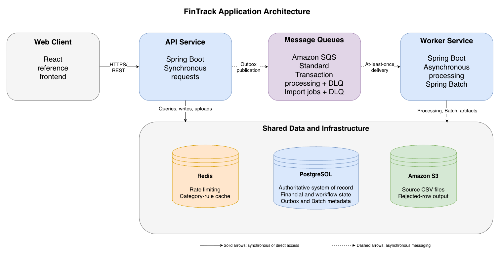
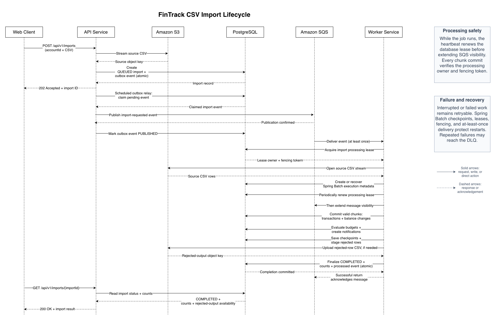

# Architecture Overview

This document explains FinTrack’s major components, responsibilities, runtime dependencies, and primary data flows.

It is intended to provide enough context for Java and Spring contributors to begin working on the project without first understanding every reliability mechanism or AWS resource.

## System overview

FinTrack is an event-driven personal finance platform composed of two independently deployable Spring Boot applications:

- the **API service**, which handles synchronous user requests;
- the **worker service**, which performs asynchronous processing and batch imports.

The services communicate through immutable event contracts and Amazon SQS. They intentionally share one PostgreSQL database because they currently belong to one financial-management bounded context.

PostgreSQL is the authoritative system of record. Redis, SQS, and S3 support specialized runtime behavior but do not replace the database as the source of truth.



The editable diagrams.net source is available in [`application-architecture.drawio`](../diagrams/application-architecture.drawio).

## Application components

| Component | Responsibility |
|---|---|
| `api-service` | Exposes REST endpoints, authenticates and authorizes users, manages accounts, transactions, budgets, imports, notifications, and summaries, and publishes events through the transactional outbox. |
| `worker-service` | Consumes SQS events, categorizes transactions, evaluates budgets, creates notifications, and processes CSV imports through Spring Batch. |
| `event-contracts` | Contains immutable, versioned event payloads shared by the API and worker. It is a library, not a deployable service. |
| `frontend` | Provides a responsive React reference interface for demonstrating and manually exercising the backend. It is not the project’s primary engineering focus. |

## API service

The API service owns the synchronous HTTP boundary.

Its responsibilities include:

- registration, login, logout, and refresh-token rotation;
- JWT authentication and authorization;
- Redis-backed request rate limiting;
- user and profile operations;
- financial-account creation and updates;
- manual transaction creation;
- transaction filtering and pagination;
- category overrides;
- budget management;
- notification queries and read-state updates;
- spending and budget summaries;
- CSV upload validation and import creation;
- Flyway database migrations;
- transactional outbox creation and relay.

Commands that must immediately preserve a database invariant are completed synchronously. Longer-running enrichment and import work is delegated to the worker through SQS.

## Worker service

The worker service is intentionally non-web and receives work through SQS listeners.

Its responsibilities include:

- idempotent event consumption;
- transaction categorization;
- budget evaluation;
- persistent notification creation;
- restartable Spring Batch import jobs;
- chunk-level transaction processing;
- rejected-row staging and artifact creation;
- import lease management and fencing;
- SQS visibility extension during long-running work;
- stale execution and failed-import recovery;
- cleanup and retention workflows.

A successfully returned listener invocation allows the SQS message to be acknowledged. An unexpected failure leaves the message available for retry and eventual dead-letter handling.

## Shared event contracts

The `event-contracts` module provides the messages exchanged between the services:

- `TransactionProcessingRequestEvent`
- `TransactionImportRequestedEvent`

Each event contains a stable event identifier and an explicit version. This allows the worker to detect duplicate delivery and reject unsupported contract versions.

The API and worker depend on this module, but neither service calls the other service’s Java classes or HTTP endpoints.

## Runtime dependencies

| Dependency | Role |
|---|---|
| PostgreSQL | Authoritative storage for users, accounts, transactions, budgets, notifications, imports, outbox events, idempotency records, refresh tokens, and Spring Batch metadata. |
| Redis | Distributed API rate limiting and worker categorization-rule caching. Redis is not authoritative financial storage. |
| Amazon SQS | At-least-once delivery of transaction-processing and import-processing events. |
| Amazon S3 | Private storage for uploaded CSV source files and generated rejected-row artifacts. |
| Spring Batch | Chunk processing, job metadata, checkpoints, skip handling, restart, and recovery for imports. |
| Flyway | Versioned PostgreSQL schema creation and evolution, owned by the API service. |

Local development uses PostgreSQL, Redis, and LocalStack through Docker Compose. LocalStack provides S3- and SQS-compatible services without requiring an AWS account.

## Core application flows

### Authentication

1. A user registers or signs in through the API.
2. Spring Security validates the request and credentials.
3. The API issues a short-lived JWT access token and a longer-lived refresh token.
4. Refresh tokens are hashed and stored in PostgreSQL.
5. Authenticated requests send the access token as a bearer token.
6. Refresh-token rotation uses database locking to protect concurrent reuse.
7. Redis-backed filters apply distributed request limits.

JWT access tokens allow ordinary authenticated requests to be validated without loading a server-side session for every request.

### Manual transaction processing

1. The API validates the request and verifies that the account belongs to the authenticated user.
2. One PostgreSQL transaction:
    - creates the financial transaction;
    - updates the account balance;
    - creates a transaction-processing outbox event.
3. The API returns without waiting for categorization or budget evaluation.
4. The scheduled outbox relay claims and publishes the event to SQS.
5. The worker receives the event and records its stable event identifier in the idempotency table.
6. In one worker transaction, it:
    - loads the owned transaction;
    - categorizes it unless a manual override exists;
    - marks it as processed;
    - evaluates any affected expense budget;
    - creates a notification when required.
7. The listener returns successfully and the SQS message is acknowledged.

The outbox prevents a committed transaction from losing its corresponding asynchronous processing request.

### Category override processing

When a user overrides the category of an already processed transaction, the API creates another outbox event using the existing transaction-processing workflow.

The worker preserves the manual override, reevaluates the affected budget, and relies on database uniqueness constraints to prevent duplicate historical notifications.

### CSV import processing



The editable diagrams.net source is available in [`csv-import-lifecycle.drawio`](../diagrams/csv-import-lifecycle.drawio).

1. The API validates the file, account ownership, content type, size, and basic upload requirements.
2. The source CSV is streamed to a private S3 object.
3. One PostgreSQL transaction creates:
    - a queued import record;
    - an import-requested outbox event.
4. The outbox relay publishes the event to the import SQS queue.
5. A worker attempts to acquire the import’s database processing lease.
6. After acquiring ownership, the worker starts a heartbeat that renews the database lease and then extends SQS message visibility.
7. The worker launches or recovers the corresponding Spring Batch job.
8. Spring Batch streams the source file from S3 and processes it in chunks.
9. Each committed chunk atomically persists its valid work, including:
    - imported transactions;
    - account-balance changes;
    - affected budget evaluations and notifications;
    - durable staging rows for supported rejected records.
10. Every chunk commit verifies that the worker still owns the import lease by checking the processing owner and fencing token.
11. After the job completes, the worker reconstructs and uploads the rejected-row CSV.
12. A final database transaction verifies lease ownership, marks the import complete, and records the consumed event as processed.
13. Rejected-row staging is cleaned separately and can be removed later by retention cleanup if immediate cleanup fails.

A failed batch job is marked failed and the SQS message remains unacknowledged. Spring Batch checkpoints and import recovery allow later processing attempts to resume safely.

### Read and summary requests

Account, transaction, budget, notification, and summary queries are served synchronously by the API from PostgreSQL.

Summary endpoints use database projections and aggregate queries instead of loading every transaction into application memory.

## Consistency model

FinTrack combines immediate database consistency with eventual asynchronous processing.

Immediately consistent operations include:

- account-balance changes;
- transaction and outbox creation;
- import and outbox creation;
- token rotation;
- explicit user updates;
- batch chunk commits.

Eventually completed operations include:

- transaction categorization;
- budget evaluation after transaction creation;
- notification creation;
- outbox publication;
- CSV import completion.

SQS provides at-least-once delivery, not exactly-once delivery. FinTrack therefore expects duplicate messages and protects processing with:

- stable event identifiers;
- processed-message records;
- database uniqueness constraints;
- transactional writes;
- retries and dead-letter queues;
- leases and fencing for long-running imports.

The detailed rules belong in [Reliability and concurrency](reliability-and-concurrency.md).

## Database and service boundaries

The API and worker intentionally share one PostgreSQL database.

This is a deliberate modular-system design rather than an attempt to present the applications as fully isolated microservices. The shared database keeps cross-cutting financial invariants, Spring Batch metadata, and transactional processing practical for the current project.

Future growth is protected through:

- feature-oriented Java packages;
- independently deployable API and worker applications;
- immutable event contracts;
- no direct service-to-service Java calls;
- explicit synchronous and asynchronous boundaries;
- Flyway-managed schema evolution;
- PostgreSQL as the single authoritative store;
- documented transaction and ownership rules.

A future service or database split should happen only after a domain has clear ownership, independent scaling needs, and a justified consistency model. The roadmap should not introduce distributed boundaries merely to make the system appear more microservice-oriented.

## AWS deployment topology

Most Java contributions do not require knowledge of this section or access to AWS.

In the deployed development environment:

1. A browser connects to CloudFront over HTTPS.
2. CloudFront sends frontend requests to a private S3 origin.
3. API paths are forwarded to an internet-facing Application Load Balancer.
4. The load balancer forwards healthy requests to API tasks running on ECS Fargate.
5. API and worker tasks run in private application subnets.
6. PostgreSQL and Redis run through RDS and ElastiCache in private data subnets.
7. S3, SQS, ECR, Secrets Manager, and CloudWatch are regional AWS services rather than resources running inside the application subnets.
8. A NAT gateway provides controlled outbound internet access from private application subnets.
9. IAM task roles provide AWS credentials without embedding access keys in the containers.

Terraform defines the environment, while GitHub Actions builds images, pushes them to ECR, registers task-definition revisions, and updates the ECS services.

The hosted environment is intentionally cost-conscious. It demonstrates the production deployment model but does not currently duplicate every stateful component or runtime task for full high availability.

Detailed provisioning, availability limitations, and cost-conscious tradeoffs belong in the [AWS deployment guide](../deployment/aws-deployment.md).

## Security boundaries

FinTrack applies security in several independent layers:

- Spring Security authenticates and authorizes application requests.
- JWT access tokens carry authenticated identity.
- Hashed, rotating refresh tokens provide controlled session renewal.
- BCrypt protects stored user passwords.
- Redis-backed rate limits protect sensitive and general endpoints.
- Ownership checks prevent users from accessing another user’s financial data.
- Security groups restrict network communication between AWS components.
- IAM roles restrict API, worker, deployment, and task-execution permissions.
- Secrets Manager stores deployment secrets.
- S3 public-access controls and bucket policies protect stored files.
- CloudFront provides the public HTTPS entry point.

Application authorization, network reachability, and IAM permissions are different security dimensions. Passing one boundary does not automatically bypass the others.

## Observability

Both services produce structured JSON logs in the deployed environment and propagate correlation identifiers through supported HTTP and event flows.

Spring Boot Actuator and Micrometer expose health and application metrics. AWS collects operational information through:

- CloudWatch log groups;
- ECS and load-balancer metrics;
- SQS and dead-letter-queue metrics;
- dashboards;
- alarms;
- SNS email notifications.

These signals help diagnose failures across API requests, outbox publication, SQS consumption, batch processing, and infrastructure.

## Repository map

```text
fintrack-platform/
├── event-contracts/          Immutable shared event payloads
├── services/
│   ├── api-service/          HTTP, security, commands, queries, outbox, Flyway
│   └── worker-service/       SQS processing, categorization, budgets, batch imports
├── frontend/                 Reference React client
├── infrastructure/           Docker Compose and LocalStack initialization
├── deployment/terraform/     AWS infrastructure definitions
├── performance-tests/        k6 smoke and load scenarios
└── docs/                     Contributor, architecture, deployment, and operations guides
```

## Related documentation

- [Local development](../getting-started/local-development.md)
- [Configuration](../getting-started/configuration.md)
- [Reliability and concurrency](reliability-and-concurrency.md)
- [Architecture decisions](decisions/README.md)
- [AWS deployment architecture](../deployment/aws-deployment.md)
- [Contributing guide](../../CONTRIBUTING.md)