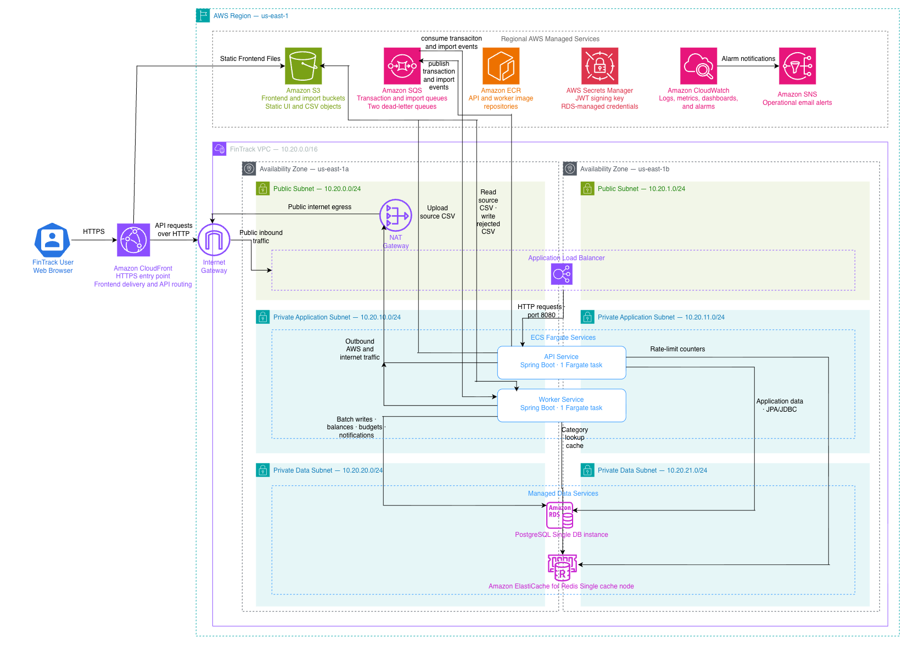

# AWS Deployment Architecture

This document explains FinTrack’s deployed AWS environment, how requests and background work move through it, and which design decisions were made to keep the demonstration affordable.

> Java and Spring contributors do not need AWS knowledge to contribute. Use the [local development guide](../getting-started/local-development.md) to run PostgreSQL, Redis, S3, and SQS-compatible infrastructure locally through Docker and LocalStack.

The editable source is available in [aws-architecture.drawio](../diagrams/aws-architecture.drawio).

## Architecture at a glance

FinTrack uses:

- CloudFront as the public HTTPS entry point.
- S3 to host the frontend and store transaction-import files.
- An Application Load Balancer to route API traffic.
- ECS with Fargate to run the API and worker containers.
- RDS for PostgreSQL application data.
- ElastiCache for Redis rate limits and category caching.
- SQS for asynchronous transaction and import processing.
- ECR for application container images.
- Secrets Manager for runtime credentials.
- CloudWatch and SNS for operational visibility and alerts.
- Terraform to define and reproduce the environment.
- GitHub Actions with AWS OIDC for deployments without stored AWS access keys.

## Public request flow

1. A browser connects to CloudFront over HTTPS.
2. CloudFront serves frontend files from the private frontend S3 bucket.
3. Requests matching API paths are forwarded to the Application Load Balancer.
4. The load balancer forwards healthy requests to the API service on port 8080.
5. The API service authenticates the request and performs the appropriate application operation.

CloudFront is the intended public entry point. Static frontend responses may be cached, while authenticated API caching is disabled and authentication headers are forwarded.

Traffic from the browser to CloudFront is encrypted with HTTPS. CloudFront currently forwards API requests to the load balancer over HTTP. This is a documented cost-conscious tradeoff: adding end-to-end HTTPS would require a custom domain and an ACM certificate for the load balancer.

## Asynchronous processing flow

FinTrack keeps heavier financial processing outside the HTTP request lifecycle.

For a manual transaction:

1. In one PostgreSQL transaction, the API creates the financial transaction, updates the associated account balance, and stores a transactional outbox event.
2. The outbox relay publishes the event to the transaction-processing SQS queue.
3. The worker consumes the event, categorizes the transaction unless a manual override exists, marks it as processed, evaluates the affected budget, and creates a notification when required.

For a CSV import:

1. The API uploads the source CSV to the imports S3 bucket.
2. The API stores the import record and its transactional outbox event.
3. The outbox relay publishes the import event to the import-jobs SQS queue.
4. The worker reads the source file from S3.
5. A restartable Spring Batch job validates, categorizes, and persists transactions in chunks.
6. Rejected rows are written back to S3 as a rejected-row CSV.
7. The import is finalized and the SQS message is acknowledged.

Each processing queue has a dead-letter queue for messages that exhaust their delivery attempts.

## Resources inside the VPC

The FinTrack VPC uses the address range 10.20.0.0/16 and spans two Availability Zones.

| Network area | Purpose |
|---|---|
| Public subnets | Host the Application Load Balancer network presence and the NAT gateway |
| Private application subnets | Allow ECS Fargate to place API and worker tasks without public IP addresses |
| Private data subnets | Provide isolated subnet groups for RDS PostgreSQL and ElastiCache Redis |
| Internet gateway | Connects public-subnet routing to the internet |
| NAT gateway | Gives private application tasks outbound access without making those tasks publicly reachable |

The Application Load Balancer spans both public subnets as one logical AWS resource.

The API and worker ECS services can place tasks in either private application subnet. The current cost-conscious deployment maintains one task for each service.

The RDS and ElastiCache subnet groups span both private data subnets. However, the current deployment uses one PostgreSQL instance and one Redis cache node. The two-subnet layout prepares the network for future high-availability upgrades but does not make the current database or cache multi-AZ.

## AWS-managed services outside the VPC

Several AWS services are regional managed services rather than resources placed directly inside FinTrack’s subnets.

| Service | FinTrack usage |
|---|---|
| S3 | Frontend files, source CSV imports, and rejected-row CSV files |
| SQS | Transaction-processing and import-processing queues with dead-letter queues |
| ECR | API-service and worker-service container images |
| Secrets Manager | JWT signing material and RDS-managed credentials |
| CloudWatch | Structured logs, metrics, dashboards, and alarms |
| SNS | Operational email notifications |

The API and worker reach these services through AWS service endpoints. Because the current environment does not use VPC endpoints, traffic originating from private tasks uses the NAT gateway when necessary.

## Redis and PostgreSQL responsibilities

PostgreSQL is shared by the API and worker services and is the authoritative application datastore.

The API uses PostgreSQL for users, accounts, transactions, budgets, notifications, imports, refresh tokens, outbox events, and related application state. The worker writes transaction-processing results, balances, budget evaluations, notifications, import progress, batch metadata, and idempotency records.

Redis is shared infrastructure with narrower responsibilities:

- The API stores distributed rate-limit counters in Redis.
- The worker uses Redis as a category lookup cache.

Redis is not the authoritative source for financial data.

## Security boundaries

FinTrack uses two complementary security layers.

### Network security

Route tables determine which network paths exist, while security groups restrict which components may communicate through those paths.

The intended rules include:

- Public traffic reaches the API through CloudFront and the load balancer.
- The API accepts application traffic from the load balancer.
- The worker exposes no public HTTP endpoint.
- PostgreSQL accepts traffic only from the API and worker security groups.
- Redis accepts traffic only from the API and worker security groups.
- Private application tasks use the NAT gateway for permitted outbound traffic.

### AWS identity and permissions

IAM roles control access to AWS-managed services.

FinTrack separates these responsibilities:

- The ECS task execution role lets Fargate retrieve container images, runtime secrets, and logging configuration.
- The API task role grants only the S3 and SQS permissions required by the API.
- The worker task role grants only the S3 and SQS permissions required by the worker.
- The GitHub Actions deployment role allows the repository’s deployment workflow to publish images and update ECS services.
- GitHub assumes its deployment role through OIDC, so long-lived AWS access keys are not stored in GitHub.

Secrets Manager keeps sensitive runtime values outside container images and committed configuration files.

## Deployment flow

The backend deployment workflow performs the following high-level sequence:

1. Run the Maven verification suite.
2. Determine which backend services changed.
3. Build the required container images.
4. Push immutable image versions to the corresponding ECR repositories.
5. Register new ECS task-definition revisions.
6. Update the affected ECS services.
7. Wait for ECS to replace the running tasks and reach a stable state.

ECS maintains the desired task count. Fargate provisions the required compute, retrieves the image and secrets, starts the container, and assigns the task a private VPC address.

The API service registers its healthy task with the load balancer target group. The worker service runs privately and consumes SQS messages without a load balancer.

Terraform defines the AWS environment. Its remote state is stored in a separately bootstrapped S3 state bucket, which is different from both application S3 buckets.

## Operations and observability

The API and worker write structured JSON logs to standard output. The Fargate logging configuration sends those logs to separate CloudWatch log groups.

CloudWatch also provides:

- Service and infrastructure metrics.
- An operations dashboard.
- Queue and dead-letter-queue monitoring.
- Load balancer and target-health monitoring.
- ECS running-task monitoring.
- Configured alarms.

Selected alarms publish to an SNS topic that sends operational email notifications.

## Cost-conscious decisions

The deployed environment demonstrates the complete architecture while deliberately avoiding unnecessary always-on capacity.

Current compromises include:

- One API Fargate task.
- One worker Fargate task.
- One PostgreSQL database instance.
- One Redis cache node.
- One NAT gateway shared by both application subnets.
- No private VPC endpoints for S3, SQS, ECR, or CloudWatch.
- HTTP between CloudFront and the load balancer.
- No custom domain.
- No cross-region disaster-recovery environment.

These decisions reduce cost but also mean the current deployment is not fully highly available. The VPC and subnet layout provide a foundation for later adding more tasks, Multi-AZ RDS, Redis replicas, another NAT gateway, private endpoints, and end-to-end TLS.

## Source of truth

The diagram is explanatory. The Terraform configuration under `deployment/terraform` remains the authoritative definition of the deployed AWS environment.